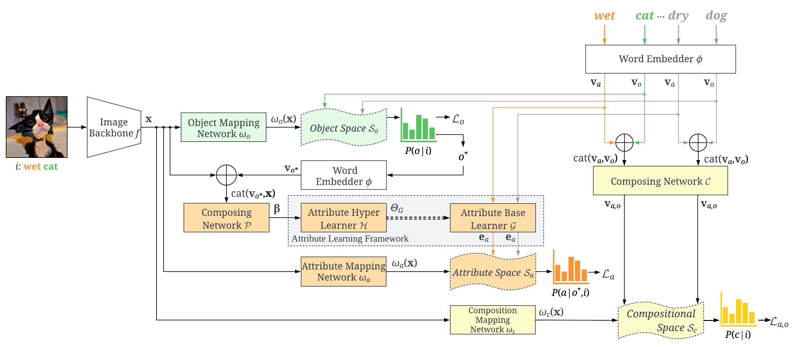

## Conditional Attribute Network CANet
This is the offical pytorch code for the paper:

Learning Conditional Attributes for Compositional Zero-Shot Learning, CVPR 2023
<p>

</p>

If you find this work interesting please cite

```
@inproceedings{wang2023learning,
  title={Learning Conditional Attributes for Compositional Zero-Shot Learning},
  author={Qingsheng Wang, Lingqiao Liu, Chenchen Jing, Hao Chen, Guoqiang Liang, Peng Wang, Chunhua Shen},
  booktitle={CVPR},
  year={2023}
}
```

All code was implemented using Python 3.10 and Pytorch on Ubuntu.

# Data Preparation

Download datasets UT-Zappos50K, MIT-States, or C-GQA and unzip them into a dataset folder e.g. "/home/XXX/datasets".
